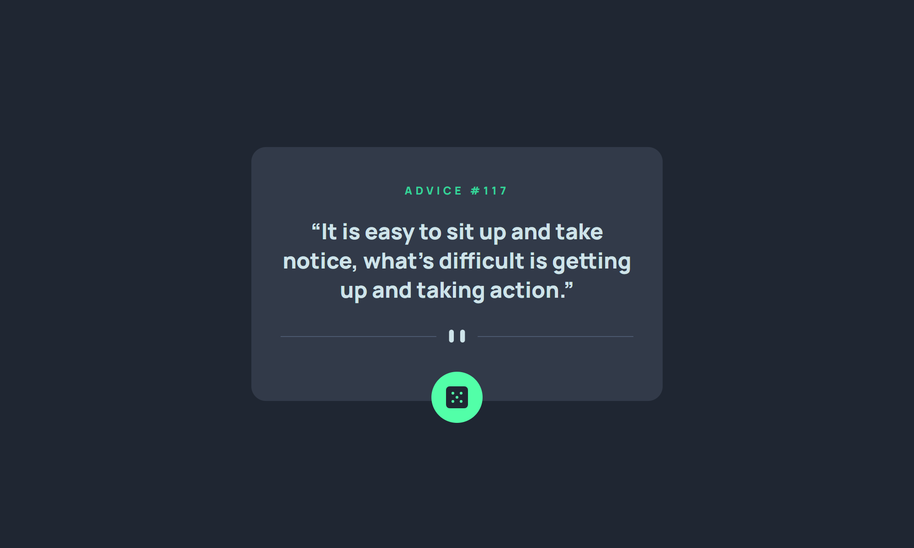

# Frontend Mentor - Advice generator app solution

This is a solution to the [Advice generator app challenge on Frontend Mentor](https://www.frontendmentor.io/challenges/advice-generator-app-QdUG-13db). Frontend Mentor challenges help you improve your coding skills by building realistic projects.

## Table of contents

- [Overview](#overview)
  - [The challenge](#the-challenge)
  - [Screenshot](#screenshot)
  - [Links](#links)
- [My process](#my-process)
  - [Technology Used](#technology-used)
  - [What I learned](#what-i-learned)
  - [Useful resources](#useful-resources)
- [Author](#author)
- [Acknowledgments](#acknowledgments)

## Overview

### The challenge

Users should be able to:

- View the optimal layout for the app depending on their device's screen size
- See hover states for all interactive elements on the page
- Generate a new piece of advice by clicking the dice icon

### Screenshot

### Links

- **Solution:** [Frontend Mentor - Advice Generator App](https://www.frontendmentor.io/solutions/advice-generator-app-tvM8xbKama) 🛠️
- **Live Site:** [View Live Site - Advice Generator App](https://advice-generator-app-9eb.pages.dev/) 🌐✨

## My process

### Technology Used

- [**Advice Slip API:**](https://api.adviceslip.com/) The API used to fetch random advice dynamically.
- [**Tailwind CSS:**](https://tailwindcss.com/) A utility-first CSS framework to streamline styling.

### What I learned

1. **Handling API JSON Data:** I explored using the Fetch API to retrieve and process JSON data from an api dynamically.
2. **Fetch API Cache Option:** I utilized the cache option of the Fetch API to override the default API behavior and request a fresh quote on each button click.
3. **Request Debouncing:** I applied a debouncing technique to efficiently manage API requests, preventing multiple requests from firing simultaneously.

### Useful resources

- [**Quoting in HTML: Quotations, Citations, and Blockquotes:**](https://css-tricks.com/quoting-in-html-quotations-citations-and-blockquotes/) Helped understand semantic HTML for quotes.
- [**W3Schools: JavaScript Fetch API**](https://www.w3schools.com/js/js_api_fetch.asp): A beginner-friendly guide to understanding the Fetch API.
- [**W3Schools: JavaScript Promises**](https://www.w3schools.com/js/js_promise.asp): Excellent explanation of promises and their usage.
- [**W3Schools: JavaScript Async/Await**](https://www.w3schools.com/js/js_async.asp): A handy reference for simplifying asynchronous JavaScript.
- [**Frontend Mentor - Advice Generator App - Rebecca Padgett**](https://www.frontendmentor.io/solutions/responsive-advice-generator-app-using-html-css-and-javascript-_Zaz_ZWXT_) 🛠️

## Author

Created by [**Fortune Iyoha**](https://linktr.ee/fortuneiyoha). 🌟 Connect with me on my [Frontend Mentor profile](https://www.frontendmentor.io/profile/fortuneiyoha) or follow me on [𝕏 (formerly Twitter)](https://x.com/fortuneiyoha) for updates and web development discussions. 💬

## Acknowledgments

A huge thanks to [**@bccpadge**](https://github.com/bccpadge/) for her effective method of cache setup, which inspired me to implement a reliable fetching process in this project.
